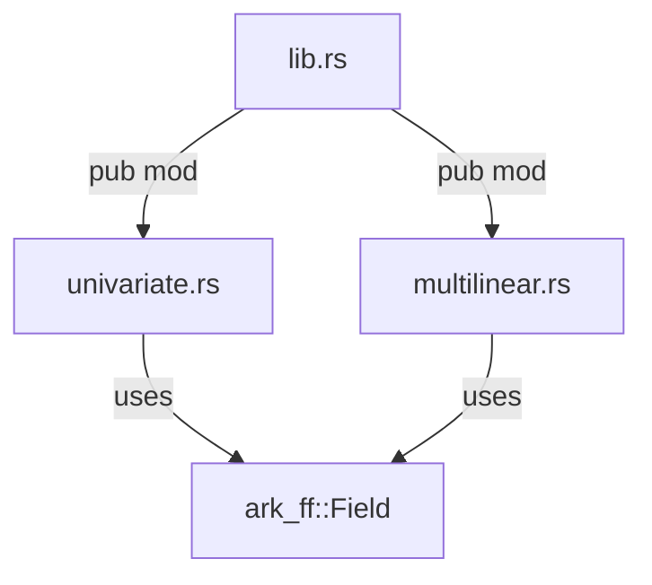

# Polynomials — Codebase Structure

This crate implements **univariate** and **multilinear** polynomials over any finite field, using [`ark-ff`](https://docs.rs/ark-ff) for field arithmetic.

---

## Dependencies

| Crate    | Version | Purpose                                     |
|----------|---------|---------------------------------------------|
| `ark-ff` | 0.5     | Provides the `Field` trait and field types   |

```toml
# Cargo.toml
[package]
name = "polynomials"
version = "0.1.0"
edition = "2024"

[dependencies]
ark-ff = "0.5.0"
```

---

## Module Tree

```
polynomials/
├── Cargo.toml
└── src/
    ├── lib.rs              ← re-exports both modules
    ├── univariate.rs       ← UnivariatePolynomial<F>
    └── multilinear.rs      ← MultilinearPolynomial<F>
```

### How the modules connect



- **`lib.rs`** is the crate root. It declares and re-exports both sub-modules.
- **`univariate.rs`** defines `UnivariatePolynomial<F: Field>` — a single-variable polynomial stored as a coefficient vector.
- **`multilinear.rs`** defines `MultilinearPolynomial<F: Field>` — a multi-variable polynomial (each variable has degree ≤ 1) stored as an evaluation table over the Boolean hypercube.

---

## `lib.rs`

This is the crate entry point. It simply exposes the two modules:

```rust
pub mod univariate;
pub mod multilinear;
```

That's it. All the real logic lives in the sub-modules — covered in [univariate.md](./univariate.md) and [multilinear.md](./multilinear.md).

---

## Reading Order

1. **You are here** → `structure.md` (module layout)
2. [univariate.md](./univariate.md) → single-variable polynomials
3. [multilinear.md](./multilinear.md) → multilinear extensions & the Boolean hypercube
